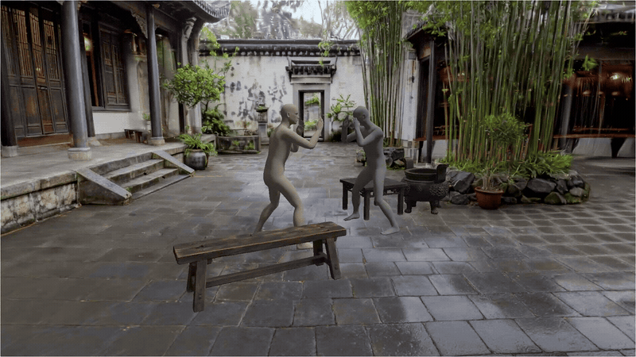
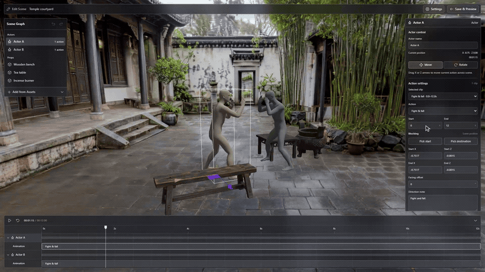
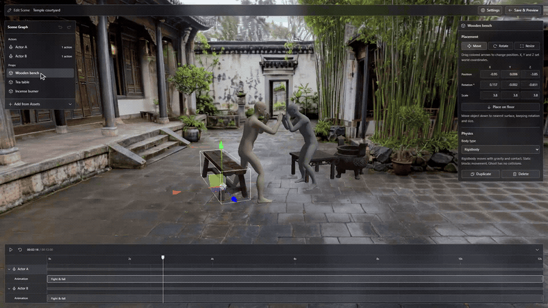
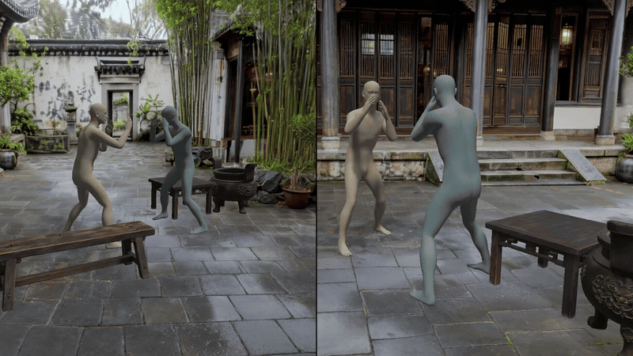

# scenra

<p align="center">
  <strong>3D previsualization for AI video creators.</strong>
</p>

<p align="center">
  Build scenes, stage performers, and choose camera viewpoints.<br>
  <strong>Record reference videos with explicit motion, framing, and spatial relationships.</strong>
</p>

<p align="center">
  <a href="https://github.com/aytoast/scenra/stargazers"></a>
  <a href="https://github.com/aytoast/scenra/commits/main"></a>
</p>

<p align="center">
  <a href="https://aytoast.github.io/scenra/studio/#/temple-courtyard">Try studio</a> ·
  <a href="https://aytoast.github.io/scenra/">Project website</a> ·
  <a href="#workflow">Workflow</a> ·
  <a href="#install">Install</a> ·
  <a href="#architecture">Architecture</a>
</p>



Scenra turns scene images into editable 3D sets for video previsualization. Creators arrange props, sequence performer motion, explore camera viewpoints, and export reference videos for downstream AI video generation.

Shared geometry and saved choreography provide consistent spatial references across viewpoints. Final video consistency depends on downstream models.

## Workflow

1. **Build scene.** Upload scene image and identify movable props. OpenAI prepares clean background and object references; World Labs Marble generates environment; Tripo generates independent props.
2. **Stage performance.** Open **Edit Scene**, select actors and props in **Scene Graph**, and adjust placement, motion clips, timing, and orientation.
3. **Choose viewpoint.** Move Perspective Camera to inspect framing, occlusion, and performer spacing. Replay or scrub actor timeline.
4. **Record reference.** Choose **Record view**, stop recording, and download WebM for downstream video workflows.

Published studio includes courtyard set and saved two-performer choreography. Editing and recording run in browser; creating new scenes requires local server and provider API access.

## Feature demos

### Actor timeline

Select performers and adjust clip timing and blocking in shared scene editor.



### Prop placement

Select independent props and edit placement before replaying performance.



### Camera viewpoints

Compare identical performance from two camera positions.



## Why use it

- **Actor blocking.** Edit positions, directions, and clip timing through per-actor timeline tracks.
- **Editable props.** Move, rotate, resize, and place independent objects. Rapier supplies gravity and actor–prop contact.
- **Reusable viewpoints.** Inspect identical scene and performance from different camera positions.
- **Local exports.** Save timeline JSON and record browser-rendered WebM. Published studio stores edits in current browser.
- **Spatial preview.** WebXR supports headset entry, with optional desktop simulation. Physical PICO testing remains pending.

## Install

Use Node.js 22 or newer.

```sh
git clone https://github.com/aytoast/scenra.git
cd scenra
npm ci
npm run dev
```

Open local URL printed by Vite. Bundled courtyard playback, editing, and recording require no provider API keys.

For image-to-scene generation, copy `.env.example` to `.env` at repository root and configure:

```dotenv
WORLD_LABS_API_KEY=
OPENAI_API_KEY=
TRIPO_API_KEY=
```

Generation uses funded provider accounts. Keys remain in server-side scripts and stay out of frontend builds. Saved assets and task IDs support resuming interrupted work.

## Architecture

```text
Scene image
    |
    v
OpenAI image processing
    |                         |
    v                         v
Clean background          Object references
    |                         |
    v                         v
World Labs Marble         Tripo
Environment + collision   Textured GLB props
    |                         |
    +------------+------------+
                 |
                 v
Scenra studio + Stageon / ARDY motion
Three.js rendering + Rapier physics
                 |
                 v
Camera preview -> WebM reference video
```

- `app/` — React studio, scene editor, actor timeline, recording, and WebXR controls.
- `scripts/` and `.claude/scripts/` — asset generation, provider requests, and recovery.
- `worlds/temple-courtyard/` — bundled environment, props, and placements.
- `app/public/stageon/` — saved performer motion and skin assets.
- `submission/` — bilingual website and interactive illustrations.

GitHub Pages publishes website at `/scenra/` and studio at `/scenra/studio/` from same main commit.

## Current scope

Studio supports saved-motion playback, timeline edits, prop placement, collisions, camera preview, and recording. Director notes store intent; live text-to-motion generation is planned. Independently repositioning actors requires checking choreography contact relationships.

PICO integration uses WebXR with desktop simulator available separately. Headset tracking, performance, and recording require physical-device verification. Jupiter SR spatial monitoring remains concept work.

## Development

### Project skills

Claude Code skills live under `.claude/skills/`. Permissions, background agents, and Cursor rules use matching `scenra-*` names.

- `/scenra-project` — initialize or inspect scene project.
- `/scenra-uncover` — analyze source images and identify objects.
- `/scenra-plate` — remove confirmed objects and prepare clean background.
- `/scenra-world` — generate World Labs environment.
- `/scenra-3d` — generate independent Tripo prop.
- `/scenra-image-edit` — run standalone image edit.

### Checks

```sh
npm test
npm run typecheck
npm run build
```

Provider tests mock HTTP responses and spend no API credits. See [workflow and controls](docs/workflow.md) for generation commands, recovery, recording, and headset setup.

## Credits

Saved performer assets derive from [NVIDIA ARDY](https://github.com/nv-tlabs/ardy), with Apache License 2.0 files retained under [app/public/stageon](app/public/stageon/README.md). Stageon supplies motion playback integration. World Labs Marble supplies environments; Tripo supplies props; OpenAI supplies image processing. Rendering uses Three.js and React Three Fiber; physics uses Rapier; desktop XR simulation uses IWER.

Website concept-image provenance is recorded in [image-provenance.json](submission/assets/image-provenance.json).
