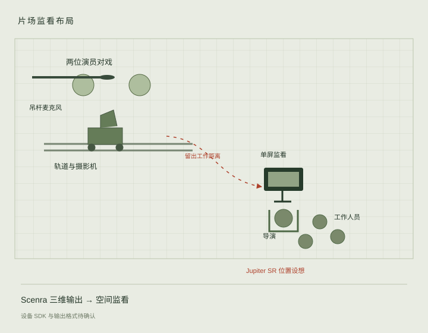

# Scenra

Virtual sets and video references for AI directors.

Application source lives at repository root: `app/`, `scripts/`, and `.claude/scripts/`. Bundled courtyard demo lives in `worlds/temple-courtyard/`. Hackathon presentation website lives in `submission/`. GitHub Pages serves actual application under `studio/` and reviewed presentation at root.

[Submission website](https://aytoast.github.io/scenra/)

[Live director workspace](https://aytoast.github.io/scenra/studio/#/temple-courtyard)

## 人物时间线

默认打开 Perspective Camera。点击 **Edit Scene**，进入编辑工作区。左侧 **Scene Graph** 统一选择角色和道具；**Add from Assets** 添加道具。选中角色后，右侧 **Actor control** 与 **Action settings** 编辑动作、起止时间、位置、朝向和导演备注。底部时间线沿用 Stageon 的角色泳道布局，播放头嵌入轨道，可直接拖动片段和两端调整时间。演示从已保存双人打斗的第 0 帧开始，动作名称为 **Fight & fall**。

选中道具后，右侧 **Move / Rotate / Resize** 分别调整位置、朝向和大小；**Place on floor** 将道具向下放到最近表面。**Settings** 集中管理角色显示、循环播放、碰撞、画质和环境。顶部 **Save & Preview** 保存布景并返回机位预览。

走位与停留复用 Studio Stageon 的本地预演和 CoreSkeleton27；已保存表演来自 ARDY。文字备注记录导演意图。当前没有持续部署的云 GPU，备注尚未连接即时动作生成。人物渲染与身体碰撞体共用同一采样结果；片段切换、拖动与重启会处理碰撞跳变。独立改编双人走位后，原始接触关系需要重新检查。

时间线按场景保存在当前浏览器，支持 JSON 导入与导出。公开静态版本可编辑布景、时间线并录制 WebM；保存布景保存在当前浏览器，创建新场景仍需本地服务。

## Jupiter SR：导演在另一角，团队围看一块小屏

我们希望保留片场里熟悉的工作方式：演员在远处对戏，摄影师沿轨道移动机位，收音员将吊杆麦克风悬在演员上方。导演坐在另一角的折叠椅上，几位工作人员从身后和侧面围看同一块监视器。一次回看，指出问题，再排一次。

Scenra 让这个监看角落延伸到虚拟制作。我们设想用 Jupiter SR 作为单屏空间监看设备，把同一三维片场的人物距离、前景遮挡和运镜纵深带进团队讨论。导演判断哪里需要改变，操作者调整角色轨道、机位或道具，再回看同一场戏。



目前无法取得 Jupiter SR 硬件。设备型号、摆放条件、SDK 和空间输出格式仍待确认。计划从 Scenra 三维场景渲染空间视图；普通摄影机单路视频不能直接等同于三维输出。PICO 使用 WebXR 路径，硬件测试仍待完成。

片场工作流参考：[Teradek 摄影助理访谈](https://teradek.com/blogs/articles/why-our-director-has-never-been-happier-feat-1st-ac-tyler-hollman)。网页概念照片由内置图像生成工具创建，用于说明监看位置。

## 即时生成与交互方向

输入是一张或多张场景图片，以及人物的动作意图。当前创建流程接收一张图片；多图输入待接入。导演选择可交互物体，安排角色走位、停留和动作，再控制机位并导出参考视频。

公开演示使用预生成场景与保存动作。云计算资源到位后，计划将动作请求、路径约束与场景信息接入生成服务，减少修改后的等待，生成时延需实测。角色视线、目标感知、抓起瓶子等动作需要进一步接入手部约束、抓握与物体附着。现有碰撞提供接触基础。

## Website preview and deployment

Presentation source lives in `submission/`. Its 3D sections use actual renderer through `?embed=1&showcase=hero`, `motion`, or `props`; inactive frames unload to release GPU resources. Images and concept photographs are grouped at bottom. Chinese is default; `?lang=en` selects English.

GitHub Pages publishes `submission/` and built studio from the same main commit. Studio uses hash routes and Vite base `/scenra/studio/`; bundled model URLs are prefixed during loading. API keys never enter build.

Turn source images into interactive 3D scenes. Image editing separates movable objects and creates clean background plates. World Labs Marble generates environments, Tripo generates textured GLB props, and Rapier runs object physics. Users explore with floating creative controls and grab objects.

## Setup

Use Node.js 22 or newer. Run commands from repository root:

```sh
npm install
npm run dev
```

Save API keys in `.env` beside this README. `.env.example` documents required variables:

```dotenv
WORLD_LABS_API_KEY=
OPENAI_API_KEY=
TRIPO_API_KEY=
```

Scripts load root `.env`, including when launched from another directory. Shell variables take precedence. Keys stay in generation scripts and are excluded from frontend bundles. Restart scripts after changing keys.

- [World Labs dashboard](https://platform.worldlabs.ai/): world generation.
- [OpenAI API keys](https://platform.openai.com/api-keys): restricted key with Image Model capabilities set to Request. Direct multipart `/v1/images/edits` needs image request access. Enable API billing and model access.
- [Tripo API dashboard](https://platform.tripo3d.ai/): create API key and fund API credits.

Optional settings: `OPENAI_IMAGE_MODEL=gpt-image-2` and `TRIPO_MODEL=v3.1-20260211`. Sound generation and playback have been removed. Generation uses direct provider APIs.

## Create, import, and record

Click **+** beside scenra or open `/create`.

- **From image:** upload PNG, JPEG, or WebP, name scene, list movable props, and optionally describe environment. Generate scene prepares clean plate with OpenAI, builds Marble world and collision mesh, creates Tripo props, and places physical objects. Progress survives reloads; Resume saved work reuses existing outputs and tasks after provider errors. Generation uses API credits.
- **Import assets:** upload World Labs SPZ, optional collision GLB and world metadata JSON, and up to eight prop GLBs. Optional saved Stageon fighters supply performers and motion. Imported assets stay local and use no generation credits.
- **Explore:** open completed scene. Edit Scene opens shared actor and prop editor. Settings controls actor visibility, looping and actor–object collisions. Fighters use body and limb colliders to push props while following saved performance.
- **Record:** Record view captures current camera canvas, including navigation, performers, and physics. Stop recording exposes Download video as WebM. Floating controls stay out of video; Backquote can hide panels without stopping recording. Recording uses browser rendering and needs no provider credits.

Uploads and generation run through local application server. Static builds support viewing, editing and recording; scene and timeline changes save in current browser. Scene creation needs local server. Keys stay in server-side scripts. Each file can be up to 40 MB, with 120 MB total request limit.

## V1 workflow

1. Start with source image and identify movable objects.
2. Use image model to isolate each object and remove those objects from background plate.
3. Send clean plate to Marble for Gaussian splat environment and collision mesh.
4. Send isolated references to Tripo for textured 3D objects.
5. Place objects in scene, set scale and physics, then save `scene.json`.
6. Explore scene with floating creative controls and interact with independent physical objects.

Open [Temple courtyard](http://127.0.0.1:5173/temple-courtyard) after `npm run dev`. `/` opens courtyard in Perspective Camera. `/<slug>` previews selected scene; `/<slug>/edit` opens Scene Graph, contextual inspector and actor timeline. Preview and editor share camera position and FOV.

Controls:

- **WASD / arrow keys:** move horizontally and strafe while floating.
- **Space / E:** rise while held; camera stays at new height after release.
- **Q / Shift:** descend while held. **F:** move faster.
- **Mouse look:** capture mouse for free look; **ESC** releases mouse.
- **Right-drag:** rotate while cursor remains available.
- **Middle-drag:** pan horizontally and vertically.
- **Left-click and drag:** grab movable object; release to drop or throw. In captured-mouse mode, center dot targets objects.
- **Mouse wheel / FOV slider:** change perspective.
- **Reset:** restore camera spawn and object placements, then rewind saved motion.
- **Scene editor:** select actors or props in Scene Graph or viewport. Both show white selection bounds and colored transform handles. Move actors across X/Z or rotate their facing; motion frames remain intact. Props support Move, Rotate, Resize and Place on floor. Edit actor clips in timeline and right inspector. Panels share light translucent surfaces with background blur. Settings adjusts world alignment, lighting and motion controls. Save & Preview returns to playback.
- **Backquote:** hide or show interface.

Included demo contains generated Marble courtyard and three dynamic Tripo props: wooden bench, tea table, and incense burner. Courtyard plate and isolated references were created with Codex image generation; saved references need no OpenAI API credits. Prompts and paths are recorded in `worlds/temple-courtyard/imagegen-manifest.json`.

Stageon default saved Fight / fall ending take loads automatically with two skinned ARDY characters in courtyard center, with movable props behind them. Playback preserves original joint positions and global rotations: 240 frames at 20 FPS, 12 seconds. Body and limb colliders follow interpolated motion and push physical props on contact in preview and editor, during playback and timeline scrubbing. Dragging prop handles temporarily fixes selected body; releasing handles restores its configured physics. Props fall, slide, and topple; fighters follow recorded choreography rather than responding as ragdolls. Use Play / Pause, Restart, scrub control, performer visibility, Fighter collisions, and Loop. Each loop and Restart restore saved prop positions and rotations, clear velocities and forces, and release active grabs before physics advances. Camera viewpoint stays unchanged. Scrubbing teleports actor colliders to selected pose and resolves contact without sweeping through scene. It does not reconstruct earlier prop trajectories. Reset restores props and rewinds motion. Saved playback uses local assets and starts no GPU or generation service.

Motion files are bundled under `app/public/stageon/`, copied from Studio Stageon. ARDY CoreSkin attribution and Apache 2.0 license remain alongside mesh. `project.json` configures motion manifest, skin URL, and scene offset under `motion`. Stageon remains source for new motion generation.

Generation scripts use funded OpenAI API for future image edits. Codex can generate images within this chat and save references for scripts to reuse. App does not invoke Codex image generation automatically.

Recover or finish demo assets using saved references and task IDs:

```sh
npm run demo:generate -- --existing-references
```

Existing models and worlds are reused, interrupted tasks resume, and missing downloads recover. Initial physics scene is created only when missing; saved placements are preserved. To create missing references with funded OpenAI API, run `npm run demo:generate`. `npm run demo:setup` prepares initial scene from existing models.

Scene data lives in `worlds/<slug>/scene.json`. Starting eye position and yaw live in `worlds/<slug>/project.json` under `player_spawn`. Local development saves scene edits to disk. Static builds load bundled scenes and save edits in current browser; writing scene files to disk requires local development server. Runtime physics movement is temporary; Reset restores saved scene.

## Generation commands

Put images in `input/` and request scenra workflow from repository root. Skills initialize project, analyze images, edit clean plates, generate worlds, and generate objects.

Standalone image edit:

```sh
node .claude/scripts/image-edit/generate-edit.mjs --image input/room.png --prompt "Remove foreground chair" --output-dir worlds/room/source --output-slug room-plate --role plate
```

3D object from existing project object:

```sh
node .claude/scripts/asset-pipeline/generate-single-asset.mjs --world room --object-id chair --image-edit-prompt "Isolate this chair on white background"
```

OpenAI defaults to `gpt-image-2`, PNG, medium quality. Options include `--quality auto|low|medium|high`, `--image-size auto|WIDTHxHEIGHT`, `--num-images 1-10`, and optional PNG `--mask-image`. Inputs support local PNG/JPEG/WebP, public URLs, or base64 data URIs.

Tripo defaults to `v3.1-20260211`, `--face-limit 50000`, textures, PBR, and triangle GLB output. Options: `--face-limit <500-1500000>`, `--enable-pbr true|false`, `--texture true|false`, `--texture-quality standard|detailed|extreme`, and `--model-version <version>`. `--smart-low-poly true` requires face limit between 500 and 20000. PBR requires texture. Local uploads require PNG or JPEG, up to 20 MB.

## Saved outputs and retries

Projects live under `worlds/<slug>/`. Generated files use `N-slug.ext`; hidden request metadata uses `.N-slug-request.json`, with `__image` and `__model` scopes for objects. Viewer consumes local GLB, SPZ, and images. Metadata excludes API keys and base64 payloads.

Tripo task IDs are saved before polling. Run same command to resume task or recover missing model from refreshed download URL. Existing files are reused. `--regenerate` requests new model using existing reference; `--regenerate-reference` requests new image and model. `--reference-only` stops after image editing.

OpenAI edits return synchronously. Interrupted response cannot be polled. Check provider usage before explicit retry: standalone edit uses `--regenerate`; object reference uses `--regenerate-reference`. Scripts never automatically resubmit ambiguous paid requests. Existing outputs from previous providers remain viewable; unfinished requests from removed providers require explicit regeneration.

## PICO 4 and VR simulation

PICO integration uses immersive WebXR in PICO Browser. Headset orientation and position control viewpoint. Left and right thumbsticks select props independently: deflect horizontally once to cycle selection, return to center to rearm, then hold thumbstick click to grab selected prop. Move controller to move prop; release click to drop or throw. Colored markers and controller labels identify selections. Both hands can hold different props; one prop cannot be held by both hands. Motion loops release both hands and reset props. Sticks do not move viewpoint.

Open [scene link](https://aytoast.github.io/scenra/studio/#/temple-courtyard) in PICO Browser and choose **Connect PICO** to request immersive WebXR. Connection uses browser running on headset; desktop button shows these steps when no headset runtime is available. **Use simulator** is separate choice for desktop exploration. Missing headset, disconnection, or rejected permission leaves both choices available; simulation starts only when selected. Scenra checks immersive WebXR support before headset entry, while simulator remains available during detection. Native WebXR requires secure origin. For local development with USB-connected headset, enable developer mode and USB debugging, authorize PC, then run `adb reverse tcp:5173 tcp:5173` using Android Platform Tools. Open `http://127.0.0.1:5173/temple-courtyard` in PICO Browser. This keeps development server bound to PC localhost. Wireless access requires HTTPS hosting; plain LAN HTTP does not enable native WebXR.

Desktop simulator works on published project and local preview. Choose **Use simulator**; no special URL is required. Simulator code loads on demand after this choice. VR simulator panel stays visible at top right: right-drag scene to turn head, click scene then use WASD to move, E/Space to rise, and Q/Shift to descend. **Mouse look** captures mouse for continuous head rotation; ESC releases it. **Reset view** restores initial headset viewpoint. **Exit simulator** returns to previous desktop camera and restores native browser XR runtime. Re-entry reuses simulator controls. IWER controls emulate two controllers, thumbstick axes, and thumbstick click. Simulator uses generic WebXR profile based on Meta Quest 3; physical PICO testing remains separate.

VR prefers available 100k splat, then 500k, then full resolution; framebuffer scale is 0.75 with foveation. Desktop post-processing and shadows are disabled during VR. Local 100k export is recommended for standalone PICO 4 performance. Desktop **Record view** exports WebM; immersive VR uses headset system recording because XR renders to headset framebuffer.

Head rotation, independent grabs, loop restoration, and session exit are checked in desktop simulation. Physical PICO 4 tracking, performance, browser compatibility, and system recording still require device testing. Native APK packaging and Jupiter SR display support remain future work.

Resources: [PICO WebXR](https://developer.picoxr.com/document/web/), [IWER simulator](https://meta-quest.github.io/immersive-web-emulation-runtime/getting-started.html), [Jupiter SR](https://www.linkedin.com/company/jupiter-sr/).

## Verification

```sh
npm test
npm run typecheck
npm run build
```

Provider tests mock HTTP responses and spend no credits. They check image requests, Tripo upload/task/download flow, World Labs recovery, metadata, and interrupted-request handling. Live generation requires funded accounts and model access.

API contracts: [OpenAI image generation](https://developers.openai.com/api/docs/guides/image-generation), [Tripo image-to-model](https://developers.tripo3d.ai/en/docs/generation-image-to-model/standard), [Tripo task query](https://developers.tripo3d.ai/en/docs/task-query).
